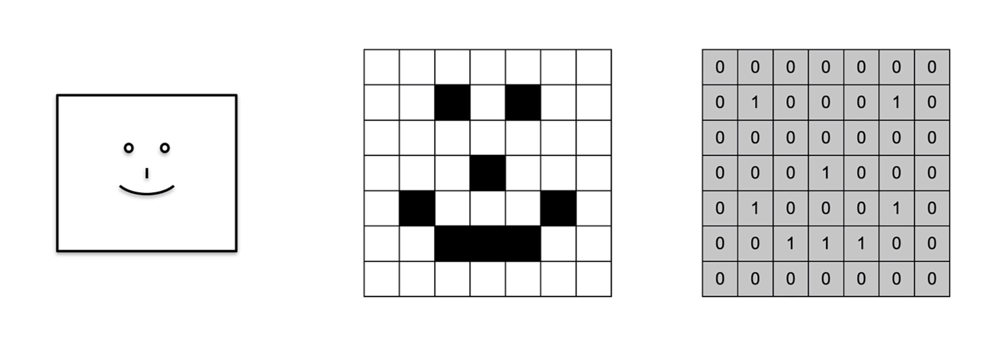

# RNC para NLP
---
## RNC básicas (para imágenes)
##### ¿Qué es una RNC y cómo funciona?
Red Neuronal Convolucional, por sus siglas RNC es una red neuronal artificial que lo que hace es tomar una imagen y cuya salida es una categoría a la que pertence una imagen.

$$\text{Imagen de entrada} \longrightarrow RNC \longrightarrow \text{Etiqueta de salida}$$

Las RNC funcionan de la siguiente manera:
1. La convolución crea **detectores de características** que recorren la imagen, las cuales generan vectores de características que nos van a indicar si cierta característica aparece o no en la imagen.

**Figura 1**

En la figura **Figura 1** anterior tenemos tres imágenes, en las cuales, la primera de lado izquierdo representa como los humanos vemos una imagen cualquiera

1. **Max Pooling**, aplica una función máxima de modo que los vectores o mapas de características reducen su tamaño, con la finalidad de mejorar el desempeño del modelo y reducir la cantidad de información.
2. **Aplanado**, se toman los mapas de características para generar un vector muy largo de manera tal que nos permita introducir estos valores a una red neuronal.
3. **Conexión completa**, una red neuronal con copas ocultas las cuales se encuentran completamente conectadas, la cual aprenderá de los rasgos extraídos de los datos con la finalidad de poder otorgar una etiqueta final.

## De imágenes a texto
## RNC para texto
