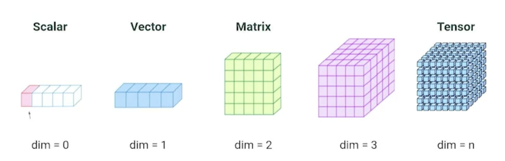

# Numpy
Miguel Angel Soto Hernandez
___

### ¿Por qué NumPy?
NumPy es una librería enfocada al cáclulo numérico y manejo de arrays.
* Es muy veliz, hasta 50 veces más rápido que usar una lista de Python o C.
* Optimiza el almacenamiento en memoria.
* Maneja distintos tipos de datos.

Documentación de [NumPy](https://numpy.org).

### Array
* Estructura central de NumPy.
* Representa datos de una manera estructurada.
* Indexado.
* Acceso a uno o muchos elementos.

### Instalación e importación
```
# Comando para instalar
!pip install numpy

# Comando para importar
import numpy as np
```

### Ejemplos básicos
##### Convertir una lista a un numpy array:
```
# Lista normal de Python
lista = [1,2,3,4,5,6,7,8,9]

# Convirtiendo lista a array de numpy
array = np.array(lista)
```

##### Crear una matriz:
```
# Lista de listas normal o matriz en Python 
matriz = [[1,2,3], [4,5,6], [7,8,9]]

# Convirtiendo lista a array de numpy
matriz = np.array(matriz)
```

##### Acceder por posiciones de indexado:
```
# Accedemos a la posición 1 de nuestro arreglo
# Sabemos que los arreglos inician desde el índice 0
array[1]
Output: 2

# Accedemos a la posición 0 de nuestra matriz
# En este caso, la primera posición corresponde a las filas y
# la segunda a las comlumnas
matriz[0]
Output: array([1,2,3])

# Accedemos a la posición [0,2] de nuestra matriz
matriz[0,2]
Output: 3
```

##### Accediendo a múltiples valores (slicing)
```
# Obtenemos los valores de la posición 0 a la 3 
# sin contar el límite
array[0:3] 
Output: array([1,2,3])

# Obtenemos los valores de la posición 1 en adelante, 
# pero solo para las filas
matriz[1:]
Output: array([[4,5,6], [7,8,9]])

# Ahora, obtenemos los valores de la posición 1 en 
# adelante para las filas y del 0 hasta la posición dos 
# para las columnas
matriz[1:, 0:2]
Output: array([[4,5], [7,8]])

# Obtenemos todos los valores con saltos de tres en tres
array[::3] 
Output: array([1,4,7])

# ¿Qué pasa si le pedimos valores negativos?
# Por defecto, NumPy nos regresa el último valor de nuestro array
# como si se estuviera regresando a valores anteriores
array[-1]
Output: 9

array[-3]
Output: array([7,8,9])
```

### Tipos de datos
Podemos asignar el tipo de datos que queremos que maneje nuestro arreglo de numpy:

```
array = np.array([0,1,2,3,4], dtype='float64')
array
Output: array([0.,1.,2.,3.,4.])
```

Incluso, podemos cambiar el tipo de arreglo que generamos:
```
array = np.array([0,1,2,3,4])
strings = np.array(['0','1','2','3','4'])

# De números enteros a decimales
array = array.astype(np.float64)
array 
Output: array([0.,1.,2.,3.,4.])

# De números enteros a booleanos
array = array.astype(np.bool_)
array 
Output: array([False,True,True,True,True])

# De números enteros a string
array = array.astype(np.string_)
array 
Output: array([b'0',b'1',b'2',b'3',b'4'], dtype='|S21')

# De strings a números enteros
array = strings.astype(np.int8)
array 
Output: array([0,1,2,3,4], dtype=int8)
```

### Dimensiones


* Escalar: un número cualquiera. Por ejemplo: `escalar = 26`
* Vector: ejemplos. Por ejemplo: una lista cualquiera de Pyhton. `vector = np.array([0,1,2,3,4])`
* Matriz 2D: ejemplos y características. Por ejemplo: una hoja de cálculo. `matriz = np.array([[1,2,3], [4,5,6]])`
* Tensor 3D: ejemplos, características y serie de tiempo. Por ejemplo: una serie de tiempo. `tensor_3d = np.array([[[1,2,3], [4,5,6]], [[1,2,3], [4,5,6]]])`
* Tensor 4D: ejemplos, ancho, alto, canales de color. Por ejemplo: imágenes.

Para poder identificar que dimensionalidad tenemos en una variable utilzamos el comando `nombre_variable.ndim`.

##### Agregar o eliminar dimensiones
Si queremos crear un vector de dimensión 10, lo podemos realizar con el siguiente comando `vector_10 = np.array([0,1,2,3,4], ndmin=10)`.

Supongamos que tenemos un vector `vector = np.array([0,1,2,3,4])` y queremos aumentar su dimensión en 1. Esto lo podemos hacer de una manera muy sencilla al realizar el siguiente comando `expanded_vector = np.expand(vector, axis=0)`.

Caso contrario, si necesitamos quitar dimensiones a un arreglo de numpy, basta con ejecutar la siguiente línea de código `vector_2 = np.squeeze(vector_10)` y con esto nos quitará las dimensiones que no son útiles.

Nota: en NumPy `axis=0` hace referencia a filas y `axis=1` hace referencia a las columnas.

___
### Reto 1
1. Definir un tensor con al menos 5 dimensiones.
2. Sumarle una dimension en cualquiera de los ejes.
3. Borrar las dimensiones que no se usan.

##### Solución
```
# Definiendo el tensor con 5 dimensiones
tensor = np.array([1,2,3], [4,5,6], [7,8,9], ndmin=5)
print(tensor, tensor.ndim)
Output: 
[[[[[1,2,3] 
    [4,5,6]
    [7,8,9]]]]]
5

# Agregar una dimensión
tensor = np.expand:dims(tensor, axis=1)
print(tensor, tensor.ndim)
Output:
[[[[[[1,2,3] 
    [4,5,6]
    [7,8,9]]]]]]
6

# Borrar las dimensiones que no se ocupan
tensor = np.squeeze(tensor)
print(tensor, tensor.ndim)
Output:
[[1,2,3] 
 [4,5,6]
 [7,8,9]]
2
```
___

### Creando arrays
##### np.arange()
La estructura de esta función es la siguiente: `np.arange(punto inicial, punto final, salto)`.

```
# Creando un arreglo con 10 posiciones iniciando en 0
array = np.arange(0,10)
Output: array([0,1,2,3,4,5,6,7,8,9])

# Creando un arreglo con iniciando en 0 hasta el 20 con
# saltos de 2
array = np.arange(0,20,2)
Output: array([0,2,4,6,8,10,12,14,16,18])
```

##### np.zeros()
Esta función es muy utilizada en la ciencia de datos, ya que nos permite crear arrays de ceros con la finalidad de crear un esquema previo. Por ejemplo:

```
# Creando un vector con una longitud de 3 con ceros en su interior
np.zeros(3)
Output: array([0.,0.,0.])

# Creando una matriz de 10x10 con ceros en su interior
np.zeros((10,10))
Output: array([[0.,0.,0.,0.,0.,0.,0.,0.,0.,0.],
                [0.,0.,0.,0.,0.,0.,0.,0.,0.,0.],
                [0.,0.,0.,0.,0.,0.,0.,0.,0.,0.],
                [0.,0.,0.,0.,0.,0.,0.,0.,0.,0.],
                [0.,0.,0.,0.,0.,0.,0.,0.,0.,0.],
                [0.,0.,0.,0.,0.,0.,0.,0.,0.,0.],
                [0.,0.,0.,0.,0.,0.,0.,0.,0.,0.],
                [0.,0.,0.,0.,0.,0.,0.,0.,0.,0.],
                [0.,0.,0.,0.,0.,0.,0.,0.,0.,0.],
                [0.,0.,0.,0.,0.,0.,0.,0.,0.,0.]])
```

##### np.ones()


