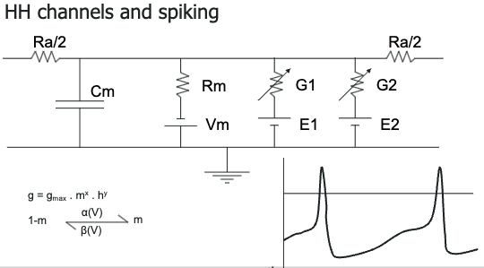

# 001: Biological Neuron Models Intro

---

# Ramón y Cajal

Muchos años atrás Ramón y Cajal describió muy poéticamente a las neuronas como las "Misteriosas mariposas del alma". El punto clave de esto, es que las neuronas tienen una gran variedad de formas y tamaños y presumiblemente estas formas y tamaños tienen algo que ver con su función.

---

# Cerebro

El cerebro esta compuesto en muchos niveles de neuronas, cicuitos y otros componentes, y esto es lo que nos interesa estudiar. El cerebro tiene alrededor de 1.3 lts de materia, consume alrededor de 20 Watts de potencia en comparación con servidores dedicados a ejecutar modelos de IA que consumen MegaWatts y solo pueden hacer una pequeña fracción de las cosas que el cerebro puede o no hacer muy bien.

Entonces, ¿Qué es lo que hacen las neuronas reales y el cerebro real que los hace mucho más efectivos?

---

# 'Neuronas' de la IA

$$\text{Suma lineal ponderada de entradas, luego función de salida no lineal }$$
$$O_i= F(\sum W_{ij}|j)$$

Un ejemplo típico de una neurona de IA, donde tiene un conjunto de entradas cada uno asociado a un peso. Todas estas entradas son ponderadas y se combinan y suman. Pasan por una funsión de trnasferencia no lineal de entrada y dalida para brindarnos una salida

---

# Wilfred Rall 1922-2018

Lo que hizo hace muchos años fue demostrar que esta imagen muy reducida de una neurona carece de algunos aspectos fundamentales muy importantes que tienen serias implicaciones computacionales. Su principal aportación fue que, la estructura intrincamente ramificada de una neurona no puede tratarse de la misma manera que una neurona puntual esférica.

---

# Hudking y Huxley: canales de iones

Demostraron que las propiedades muy dinámicas y muy complicadas de la activación de las neuronas no se pueden reducir ni a modelos simples (IF) ni a conceptos de integración y activación (LIF).

Observaron los canales de Hodking-Huxley, que llevan su nombre, los agregaron y los describieron en términos de un circuito equivalente, y como las ecuaciones HH confieren propiedades y formas de inda sobre la activación neuronal.

---

# Alan Turing: Computación química

Entre sus muchos logros, escribió un artículo sobre biología y trataba sobre como s epodían hacer álculos químicos. Estaba particularmente interesado en como es posible que a través de interacciones químicas se puedan formar una gran variedad de patrones tanto en el espacio como en el tiempo.

---

# Niveles de computación

El cerebro opera en todos estos niveles simultáneamente y de una manera extremadamente integrada. El punto clave es tan cierto como lo fue cuando apareció unos 20 o 30 años atrás, y es que, la computación ocurre en todos estos niveles, desde las moléculas, las sinapsis, las dendritas, las neuronas, los circuitos y los sisntemas hasta el compoortamiento. Que es la interacción de señales entre cada uno de estos niveles, lo que contribuye al cálculo neuronal, y que nos estamos concentrando en uno excluyendo los demás, por lo que se pierden algunos de los factores cruciales de la computación en el cerebro.

---

# Niveles de descripción

En una coincidencia un tanto aproximada con estos niveles de descripción, hay un conjunto de ecuaciones que describen aproximadamente al nivel de moléculas y sinapsis, como algunas formas de términos químicos que describen como reaccionan las moléculas y su cinética, las ecuaciones para las dentritas (difusión), neuronas (Nernst), circuitos (ecuación cable), areas y sistemas (HH) y la ecuacione para describir la transmisión sináptica (comportamiento).

Es bastante notable cuantas propiedades y que parte de la fisiología en el cerebro en todos estos niveles pueden explicarse mediante este conjunto bastante pequeño de ecuaciones. Sin emabrgo, esto es biología y es en estos parámetros, en las conexiones, en el detalle de todas estas ecuaciones donde surgen las porpiedades de las neuronas.

---

# Integrate-and-fire

El modelo IF tiene mucho mas que ver con lo que Rall estaba mirando, aunque en realidad tenía visiones más sofisticadas de la umbralización y disparo.

Pero comencemos con el núcleo de esto, que es el circuito equivalente donde tienes una membrana (Cm), el interior de la célula, el exterior de la célula, la base que indica que es el resto del citosol. La membrana tiene como aislante entre los conducores interior y exterior, actúa como una capacitancia. Hay una membrana de resistencia (Rm), un potencial de membrana (Vm), y se pueden tener varias entradas sinápticas que se representan como resistencias (Input) variables en serie con algún tipo de potencial (Erev). Y en la neurona IF, lo que sucede es que cuando le das entradas a esto y esta resistencia para corriente, podría cruzar un umbral, si lo hace, entonces, el potencial de acción de salida se apaga y pone en cortocircuito internamente este circuito, lo reinicia despejando el capacitor y permitiéndole comenzar de nuevo para otro ciclo.

La contribución de Rall, fue explicar que las neuronas reales son mucho más interesantes que estos conceptos abstractos de que esl espacio importa muchísimo

---

# Teoría del cable

Una de las intuiciones centrales o uno de los puntos de partida para pensar en como se propagan las señales en las células extendidas. Esta propagación ocurre tanto a lo largo de los axones como a lo largo de las dendritas. De hecho, cualquier cable que pueda describirse como un conductor con un aislante alrededor y luego un conductor alrededor de el.

Así que, si aplicamos un estímulo agudo en un extremo del cable y registramos lo que sucede con el potencial, en el lugar de la inyección de esta corriente se podrá ver una señal bastante aguda. Y luego, a medida que avance y se registre en diferentes posiciones a lo largo de la dendrita, se verá respuestas de entrada que cambian.

Entonces lo que esta pasando son 3 cosas:

- En primer lugar, lo más obvio es que la amplitud de la seña esta disminuyendo. Comienza alto y baja cada vez más a medida que te alejas del punto de estímulo (la amplitud decrese).
- Segundo, si observamos de cerca, veremos que la forma que comienza bonita y nítida se vuelve más suave, más ancha y más amplia (la forma se hace más tenue).
- Tercero, si observamos muy de cerca, podemos notar que el pico de cada una de estas formas de onda se retrasa ligeramente y se desplaza ligeramente en el tiempo a medida que la señal avanza por la dendrita (se retrasa el tiempo).

Entonces, ¿qué podemos hacer con esto?

---

# Teoría del cable: Decaída de la señal a través del tiempo y espacio

Podemos resumir gran parte de la teoría que se le ocurrió a Rall en dos argumentos muy simples. Y básicamente lo que nos dice es que la caída de la señal tanto a lo largo del tiempo como a lo largo del espacio es una exponencial simple. Entonces, si se mantiene el potencial en un cierto valor en el tiempo 0 y se ignora el espacio. Es decir, si tratamos la celda como un objeto puntual y luego nos preguntamos como evoluciona el potencial con el tiempo, resulta que evoluciona como una exponencial decreciente co un curso temporal característico $\Tau$.

Por el otro lado, ignoramos el tiempo, es decir, tomamos el tiempo en el infinito, en estado estacionario y nos preguntamos lo mismo a la larga distancia del potencial en este caso. Se mantienen un extremo a un cierto potencial y luego el potencial a lo largo de la longitud del cable decaerá de manera exponencial con una longitud característica $\lambda$.

Entonces, tanto en el tiempo como en el espacio hay una caída exponencial, lo cual es una forma sencialla de pensar en ello, y ambas soluciones que provienen de la ecuación del cable.

---

# Solución de Rall para la selectividad de la secuencia

Rall ideó una descripción de como una sola neurona podía realizar un cálculo bastante interesante: la selectividad de secuencia, la cual funciona de la siguiente manera:

Supongamos que tenemos una dendrita larga que culmina en el soma y se le da una secuencia de entradas en órden (1, 2, 3, 4). Consideremos lo que sucede con la primera entrada, nos conduce a un pico inicial agudo, hay una expansión y disminución en la amplitud, pero lo más importante es que también hay un aumento en el tiempo para alcanzar el pico. El tiempo que lleva es un poco más lento que el inicial, y este tiempo sigue aumentando.

Ahora, supongamos que su segunda entrada llega justo cuando la entrada de la primera ubicación ha alcanzado su punto máximo y luego aplicamos nuestra aportación. Ahora estos dos picos coincidirán y coincidirán a medida que vayamos bajando. Entonces, podemos poner nuestra tercera entrada justo cuando estos dos picos hayan llegado a este punto y obtendremos una mayor suma, y así sucesivamente. Por lo que, si sincronizamos las entradas sucesivas de tal manera que todos los picos coincidan, entonces podemos obtener una respuesta grande. Este tipo de situación podría surgir, por ejemplo, si la neurona fuera receptora de información de varios fotorreceptores y supongamos que hay una mosca pasando por el campo de visión de modo que activa este fotorreceptos y luego el dos, el tres, etc. y luego todos contribuyen a la señal de aquí, y se obtiene una señal grande. Pero hay que tener en cuenta que con esta disposición, si la mosca fuera en otra dirección, no podríamos obtener la suma, lo que no nos generaría un pico tan grande.

---

# Canales iónicos

Hudking y Huxley describieron un potencial de acción. Cuando se le entrega una carga a una célula, se produce una despolarización lenta, siguiendo las unidades que proponen HH, lo estableceremos en 0 mV, después, eventualmente se alcanza un umbral, el canal de sodio se abre y se obtiene un pico grande. Posteriormente, en algún momento, el canal de potasio se activa y el canal de sodio comienza a cerrarse y el potencial de membrana comienza a caer en picada. A medida que avanza un poco más, el canal de sodio se cierra y ahora es el canal de potasio quien genera un potencial aún más negativo que el potencial de reposo. Luego, si se espera lo suficiente, todolos los canales se cierran y la célula vuelve a su potencial de reposo y puede repetir el ciclo.

Esto puede describirse también con su circuito equivalente, donde se tiene una capacitancia, su potencial de membrana en reposo, tiene la resistencia de membrana estándar (Rm), y luego tiene las conductancias debidas al canal de potasio y sodio, las cuales son conductancias variables y dependen del potencial de membrana, razón por la cual se obtiene este efecto de retroalimentación.

---

# Diseñando un potencial de acción: Forma detallada

La forma de un potencial de acción es de crucial importancia en la función de las neuronas, y no en cualquier parte; por ejemplo, si se estropea la forma del potencial de acción en las neuronas y los músculos del corazón, se produce el desafortunado efecto secundario de que podría matar. Por lo tando, las formas de estos potenciales pueden ser muy, muy importantes. También son importantes para determinar que sucede exactamente con la función de transferencia de entrada y salida y varias otras cosas.

Entonces, ¿qué sucede durante un potencial de acción agradable y complicado que incluye estos canales? Una cosa es que cuando el potencial de acción está cerca de su pico, se abren una gran cantidad de canales, típicamente canales de calcio.

En la primera parte del gráfico se demuestra el efeccto regular, hiperpolarizante, del canal rectificador de potasio, el que se describe en HH. Ahora, pensemos en lo que sucede cuando el potencial de acción está pensando en entrar en otro ciclo (gráfico verde). Normalmente, la célula comenzaría a despolarizarse y el potencial aumentaría rápidamente, pero, llega KA, el canal de potasio hiperpolarizante y lo que sucede es que este canal se abre justo en el momento en que la célula se está recuperando de la hiperpolarización. Su región de activación esta indicada en verde y lo que eso hace es: debido a que el canal esta abierto (el canal de potasio), hace que el potencial de la célula sea más negativo y retrasa el siguiente potencial de acción, y esto ralentiza la llegada del siguiente potencial de acción y, de hecho, la presencia de este cana tiende a linealizar la activación de una célula en función de la corriente de entrada.

Pero hay otro efecto similar, solo que mediadio de una manera diferente por un canal diferente del rectificador interno. Lo que hace el rectificador interno, como su nombbre lo pordría indicar, es que se abre cuando la célula está por debajo de su potencial de reposo, por lo que es un rectificador interno y solo se abre una fase del potencial y va a pasar corriente para volver a hiperpolarizar la célula y esta activo en la región indicada en rojo. Entonces, la celda se ha vuelto más negativa y se abre el canal rectificador interno, mientras que antes en la línea gruesa, la cual podría haber recuperado su potencial con bastante rapidez, el rectificador interno mantienen la célula hiperpolarizada durante un poco más de tiempo y nuevamente el efecto es retrasar la presencia del siguiente potencial de acción.

---

# Diseñando un potencial de acción: Bursting

En esta gráfica, lo que podemos observar es lo que sucede con la interacción de la acumulación de iones de calcio con potenciales de acción que ocurren en ráfagas y algo llamado canal de potasio dependiente del calcio (kCa), de los cuales hay muchos y, también hay otros canales que también pueden comportarse de forma similar. Entonces, ¿qué obtenemos?

Supongamos que tenemos una serie de potenciales de acción y, a medida que llega cada uno, entra una ráfaga de calcio porque el canal de calcio se abre el pico del potencial de acción, el calcio se acumula y a medida que esto sucede, se abre lentamente el canal de potasio dependiente del calcio, y esto simplemente inmoviliza la célula, lo que impide que se dispare más, por lo que después de un estallido vigorozo, de repente se apaga y luego hay que esperar un rato para que el calcio se descomponga hasta niveles de reposo y luego el ciclo puede comenzar de nuevo, y las ráfagas, como sabemos, son muy importantes en la actividad neuronal y desempeñan un papel particular en la plasticidad, así como en otros tipos de flujos de señales.

Estos solo son algunos ejemplos de la complejidad que surge y que tiene un papel computacional en la función neuronal cuando se consideran los detalles biofísicos.

---

# Mielinización

Básicamente se refiere a aislar el axón y en lugar de tener una gran fibra masiva que conduce información, tienen asilamiento y una amplificaicón muy fuerte en los llamados nodos de Ranvier. En la imagen de la derecha se puede ver el axón y las capas en negro son capas de este aislamiento llamado mielina. Entonces, ahora la señal salta de un nodo al siguiente y, por lo tanto, se propaga mucho más rápido con un costo metabólico mucho menor.

Todos estos son detalles que surgen de los detalles de la biofísica de una neurona.

---

# Alan Turing: Computación química

La idea clave aquí es que como hemos estado hablando de señales eléctricas como transmisoras de información, también podemos usar señales químicas para transmitir información. Lo bueno es que hay muchos químicos. Entonces, cada sustancia química, cada identidad, cada molécula de señalización identificada, podría transportar una señal diferente. También más adelante consideraremos la separación espacial, que de hecho aumenta enormemente la cantidad de informaicón que se puede procesar mediante la química porque las escalas de longitud dde la propagación química de la difusión son mucho más cortas que las escalas de longitud del flujo de señales eléctricas, lo que significa que se pueden compartimentar las señales químicas con mucha más precisión.

---

# Lógica en la sinapsis: asociatividad = compuerta AND

En la imagen se pued ver un ejemplo clásico de señalización química o la lógica a nivel de moléculas. Esto es algo con lo que estamos un poco más familiarizados, la asociatividad debida al receptor NMDA.

La asociatividad significa que actúa como una compuerta AND, es decir, debemos tener actividad presináptica y postsináptica. Supongamos que llega una señal presináptica, provoca la liberación de neurotransmisores, lo que pasa es que su receptor AMPA habitual se abre y puede procesar algunas señales, pero el receptor NMDA permanece cerrado y la razón es que la célula todavía se encuenrta en un potencial relativamente negativo y un ión de magnesio aparece y dice: "Estoy cargado positivamente, el interior de la célula esta cargado negativamente, por lo tanto quiero entrar" e intenta entrar y tapa el poro del receptor NMDA, esto evita que cualquier señal pase a través del receptor NMDA (imagen izquierda).

Sin embargo, una vez que ha tenido suficientes potenciales de acción o por ejemplo, la propia célula dispara un potencial de acción y eso se propaga de regreso a la dendrita debido a los canales activados por voltaje, ahora puede tener la célula lo suficientemente despolarizada como para que el ión de magnesio sea expulsado del canal iónico del receptor NMDA. Ahora, cuando llega el neurotransmisor, el canal se abre y el calcio puede entrar y después de eso pueden suceder todo tipo de cosas, incluída la potenciación (LTP).

Entonces, tenemos una compuerta AND, y para esto tenemos que tener información sináptica, el neurotransmisor y tenemos que tener despolarización postináptica. Esto se implementa a través de moléculas.

---

# Interruptores biestables con conmutación y rotación

Consideremos que tenemos un sistem a de moléculas donde la molécula A activa a la molécula B y la molécula B activa la molécula A: un circuito de retroalimentación. Este es u motivo clásico para la señalización y la computación.

Entonces, en el estado de reposo, A está apagado, B está apagado y no tenemos ninguna actividad. Si le damos un estímulo fuerte: A continúa, B continúa y así A enciende a B, B enciende a A, y este estado de actividad continúa indefinidamente. Y ahora podemos dividirlo en lugar de la masa, podemos dividirlo en moléculas individuales que se activan entre sí.

Si lo traspasamos a un esquema de una dendríta... en la imagen observamos espinas dendríticas que son las manchas en forma de hongo. Digamos, a modo de argumento, que los triángulos y los círculos están en un ciclo de retroalimentación positiva y están encendidos. Se encuentran almacenando información, quizás sobre el evento anterior, pero a medida que pasa el tiempo, las moléculas comienzan a morir y se degradan, y lo que pasa es que si esto continuara seguiríamos perdiendo moléculas que retienen la señal y perderíamos la memoria, lo cual no es algo bueno. Afortunadamente, la célula está viva y dado que esta viva produce nuevas células, pero estas nuevas moléculas no saben nada sobre el estado de las moléculas existentes. Dado que hay mucha actividad aquí, los triángulo y círculos activos cercanos a los nuevos, los activarán y muy pronto las nuevas moléculas habrán sido reclutadas para ser parte de la memoria y de esta manera todas las moléculas que contienen memoria, retienen la memoria misma. Esto es realmente importante porque la vida útil de moléculas individuales de este tipo de sinapsis se mide desde minutos hasta quizas unos pocos días y nosotros realmente esperamos que nuestros recuerdos duren más que eso

---

# Números típicos del cerebro

- Tiene aprocimadamente $10^{11}$ neuronas.
- Cada neurona tiene entre $10^{3}$ y $10^{4}$ sinapsis para un total de $10^{14}$ o $10^{15}$ sinapsis.
- Cada sinapsis tiene alrededor de $10,000$ reacciones, por lo tanto se realizan muchos cálculos a nivel molecular.
- Los eventos eléctricos son rápidos y sucenden en $\lt 1 \text{ ms}$.
- Los eventos squímicos son más lentos: $1 \text{ s } \geq 1,000 \text{ s}$.
- Los eventos estructurales son aún más lentos y suceden alrededor de $100 \text{ s } \geq \text{ meses}$.
- El tiempo de vida de las proteínas es de días.
- El tiempo de vida de las neuronas y de la memoria es de 100 años

---

# Resumen

- Las redes son la metáfora dominante para la computación cerebral, pero son ineficientes.
- Las neuronas pueden realizar distintas operaciones clave:
  - Suma/integración,
  - Cálculo de secuencias
  - Asociación
  - Memoria
- Modela al nivel requerido para tus preguntas, es decir:
  - Si nuestras preguntas van realacionadas a enferemedades, desarrollo, plasticidad, recambio, lesión, entonces tenemos que incluir las moléculas porque ahí es donde se produce la cción de tales fenómenos.
  - Si nuestras preguntas van más hacia la parte de integración celular, algúnos tipos de decenicas, dinámicas rápidas, entonces deberíamos incluir la biofísica.
  - El cálculo ocurre en todas las escalas, desde la molecular hasta la eléctrica, pasando por toda la célula y los niveles de activación y red.

---
